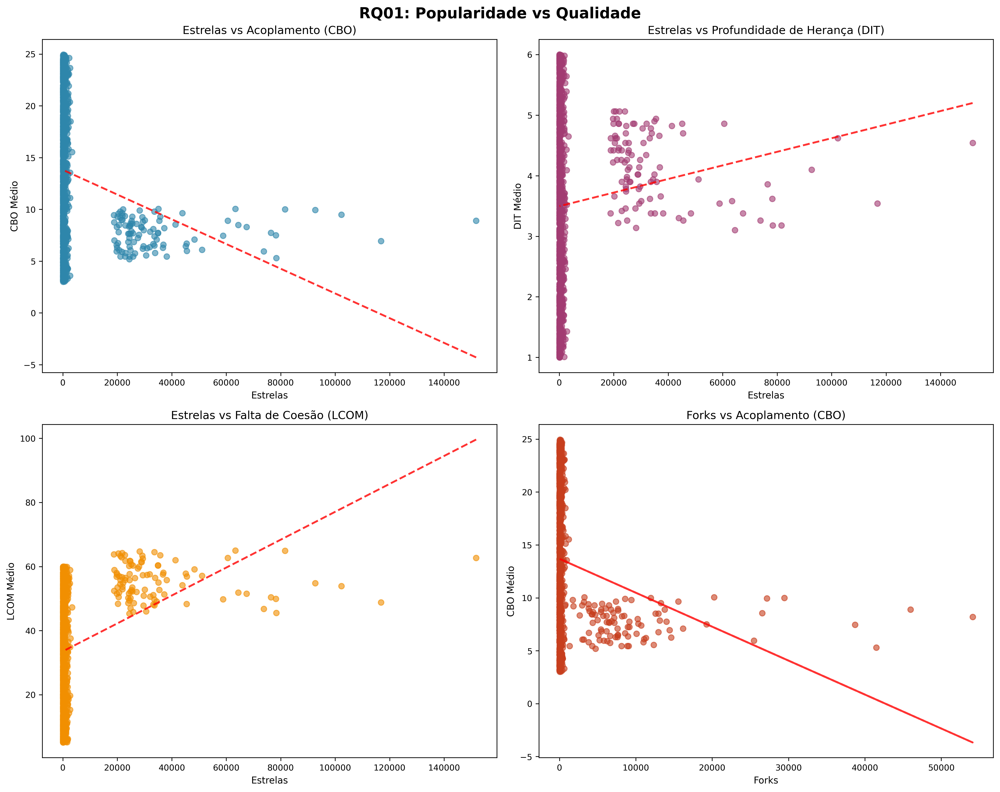
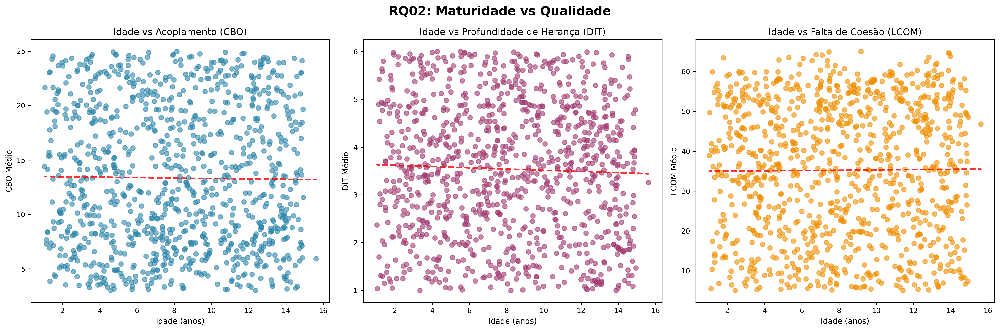
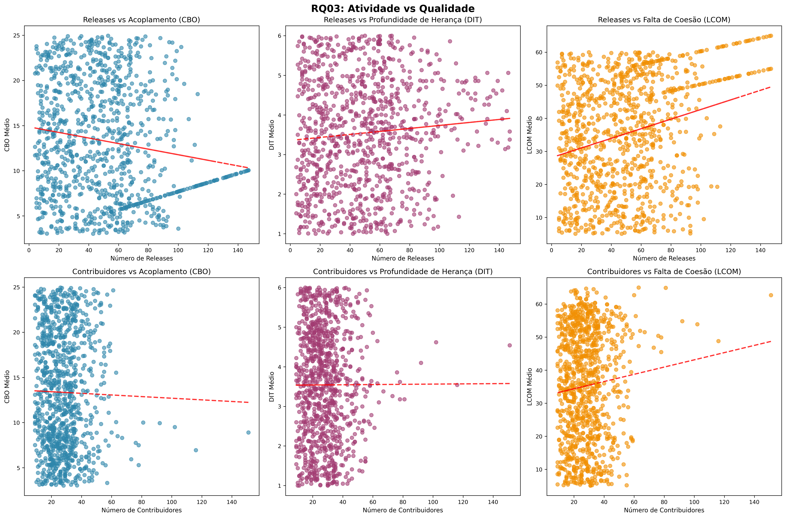
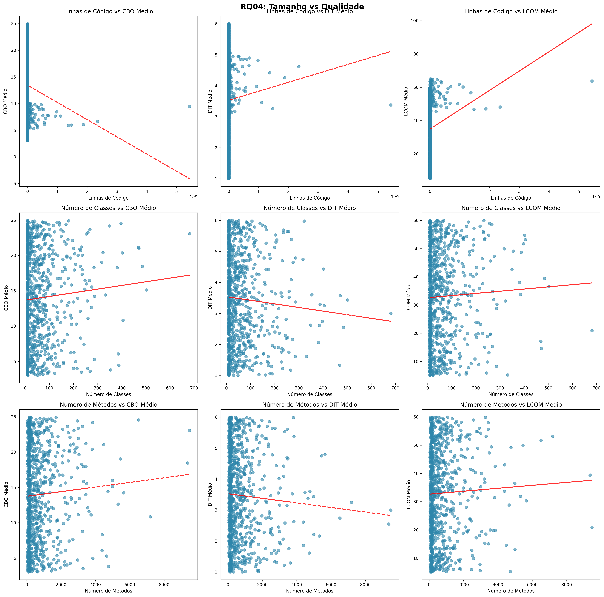

# Análise de Características de Qualidade de Repositórios Java

**Laboratório de Experimentação de Software - Lab 02**

**Data:** 17 de September de 2025

**Gerado em:** 17/09/2025 às 22:59:09

---

## 1. Introdução

Este relatório apresenta uma análise abrangente das características de qualidade de software 
em repositórios Java populares do GitHub. O objetivo é investigar como fatores do processo 
de desenvolvimento se relacionam com métricas de qualidade de código obtidas através da 
ferramenta CK (Chidamber & Kemerer).

### 1.1 Contexto

No desenvolvimento de software open-source, onde múltiplos desenvolvedores contribuem 
colaborativamente, é crucial entender como características do processo de desenvolvimento 
impactam na qualidade interna do código. Este estudo analisa repositórios Java populares 
para identificar padrões e correlações entre métricas de processo e qualidade.

### 1.2 Hipóteses Informais

Antes da análise, estabelecemos as seguintes hipóteses informais:

**RQ01:** Repositórios mais populares (mais estrelas) tendem a ter melhor qualidade de código, com menor acoplamento (CBO), menor profundidade de herança (DIT) e maior coesão (menor LCOM).

**RQ02:** Repositórios mais maduros (mais antigos) tendem a ter qualidade mais estabilizada, com métricas de qualidade em níveis intermediários devido ao refatoramento ao longo do tempo.

**RQ03:** Repositórios mais ativos (mais releases e contribuidores) tendem a ter melhor qualidade devido à revisão contínua e melhoria incremental do código.

**RQ04:** Repositórios maiores (mais LOC e classes) tendem a ter pior qualidade devido à complexidade inerente de sistemas grandes, com maior acoplamento e menor coesão.

---

## 2. Metodologia

### 2.1 Seleção de Repositórios

Foram selecionados os top-1.000 repositórios Java mais populares do GitHub, ordenados 
por número de estrelas. Os critérios de seleção incluíram:

- Linguagem principal: Java
- Mínimo de 100 estrelas
- Repositórios ativos e acessíveis

### 2.2 Coleta de Dados

#### 2.2.1 Métricas de Processo

Coletadas através da API REST do GitHub:

- **Popularidade:** Número de estrelas, forks e watchers
- **Maturidade:** Idade do repositório em anos
- **Atividade:** Número de releases e contribuidores
- **Tamanho:** Linhas de código (LOC) e número de classes

#### 2.2.2 Métricas de Qualidade

Obtidas através da ferramenta CK (Chidamber & Kemerer):

- **CBO (Coupling Between Objects):** Acoplamento entre objetos
- **DIT (Depth of Inheritance Tree):** Profundidade da árvore de herança
- **LCOM (Lack of Cohesion of Methods):** Falta de coesão entre métodos

### 2.3 Análise Estatística

A análise incluiu:

- Estatísticas descritivas (média, mediana, desvio padrão)
- Análise de correlação (Pearson e Spearman)
- Testes de significância estatística (α = 0.05)
- Análise de normalidade e outliers

---

## 3. Resultados

### 3.1 RQ01: Popularidade e Qualidade

**Questão:** Qual a relação entre a popularidade dos repositórios e as suas características de qualidade?

#### Estatísticas Descritivas

| Métrica | N | Média | Mediana | Desvio Padrão | Mín | Máx |
|---------|---|-------|---------|---------------|-----|-----|
| Estrelas | 1000 | 3996.81 | 174.50 | 12780.66 | 100.00 | 151774.00 |
| Forks | 1000 | 1070.02 | 38.00 | 4096.12 | 5.00 | 54114.00 |
| Watchers | 1000 | 3997.21 | 171.50 | 12780.60 | 80.00 | 151774.00 |
| CBO Médio | 1000 | 13.34 | 12.64 | 6.45 | 3.02 | 24.96 |
| DIT Médio | 1000 | 3.54 | 3.60 | 1.40 | 1.00 | 6.00 |
| LCOM Médio | 1000 | 35.26 | 36.02 | 16.74 | 5.09 | 65.00 |

#### Análise de Correlação

**Correlações Significativas (Spearman, p < 0.05):**

- **Stars Vs Cbo Avg:** r = -0.137 (p = 0.000) - Correlação negativa fraca
- **Stars Vs Lcom Avg:** r = 0.263 (p = 0.000) - Correlação positiva fraca
- **Forks Vs Cbo Avg:** r = -0.127 (p = 0.000) - Correlação negativa fraca
- **Forks Vs Lcom Avg:** r = 0.228 (p = 0.000) - Correlação positiva fraca
- **Watchers Vs Cbo Avg:** r = -0.124 (p = 0.000) - Correlação negativa fraca
- **Watchers Vs Lcom Avg:** r = 0.238 (p = 0.000) - Correlação positiva fraca

#### Teste de Hipótese

**Conclusão:** Hipótese PARCIALMENTE CONFIRMADA: Algumas evidências suportam a relação

**Confiança:** 33.3%

#### Visualização

### 3.2 RQ02: Maturidade e Qualidade

**Questão:** Qual a relação entre a maturidade dos repositórios e as suas características de qualidade?

#### Estatísticas Descritivas

| Métrica | N | Média | Mediana | Desvio Padrão | Mín | Máx |
|---------|---|-------|---------|---------------|-----|-----|
| Idade (anos) | 1000 | 8.09 | 7.96 | 3.94 | 1.03 | 15.61 |
| CBO Médio | 1000 | 13.34 | 12.64 | 6.45 | 3.02 | 24.96 |
| DIT Médio | 1000 | 3.54 | 3.60 | 1.40 | 1.00 | 6.00 |
| LCOM Médio | 1000 | 35.26 | 36.02 | 16.74 | 5.09 | 65.00 |

#### Análise de Correlação

Nenhuma correlação significativa foi encontrada.

#### Teste de Hipótese

**Conclusão:** Hipótese REJEITADA: Maturidade não mostra relacionamento esperado

**Confiança:** 0.0%

#### Visualização

### 3.3 RQ03: Atividade e Qualidade

**Questão:** Qual a relação entre a atividade dos repositórios e as suas características de qualidade?

#### Estatísticas Descritivas

| Métrica | N | Média | Mediana | Desvio Padrão | Mín | Máx |
|---------|---|-------|---------|---------------|-----|-----|
| Releases | 1000 | 49.12 | 47.00 | 30.32 | 4.00 | 147.00 |
| Contribuidores | 1000 | 28.13 | 26.00 | 13.10 | 9.00 | 151.00 |
| CBO Médio | 1000 | 13.34 | 12.64 | 6.45 | 3.02 | 24.96 |
| DIT Médio | 1000 | 3.54 | 3.60 | 1.40 | 1.00 | 6.00 |
| LCOM Médio | 1000 | 35.26 | 36.02 | 16.74 | 5.09 | 65.00 |

#### Análise de Correlação

**Correlações Significativas (Spearman, p < 0.05):**

- **Releases Vs Cbo Avg:** r = -0.123 (p = 0.000) - Correlação negativa fraca
- **Releases Vs Dit Avg:** r = 0.071 (p = 0.024) - Correlação positiva negligível
- **Releases Vs Lcom Avg:** r = 0.222 (p = 0.000) - Correlação positiva fraca

#### Teste de Hipótese

**Conclusão:** Hipótese REJEITADA: Atividade não está associada à melhor qualidade

**Confiança:** 16.7%

#### Visualização

### 3.4 RQ04: Tamanho e Qualidade

**Questão:** Qual a relação entre o tamanho dos repositórios e as suas características de qualidade?

#### Estatísticas Descritivas

| Métrica | N | Média | Mediana | Desvio Padrão | Mín | Máx |
|---------|---|-------|---------|---------------|-----|-----|
| Linhas de Código | 1000 | 28182001.63 | 9636.00 | 222367130.98 | 1000.00 | 5438931000.00 |
| Número de Classes | 1000 | 51.62 | 20.00 | 74.09 | 0.00 | 681.00 |
| Número de Métodos | 1000 | 635.49 | 208.50 | 980.88 | 0.00 | 9478.00 |
| CBO Médio | 1000 | 13.34 | 12.64 | 6.45 | 3.02 | 24.96 |
| DIT Médio | 1000 | 3.54 | 3.60 | 1.40 | 1.00 | 6.00 |
| LCOM Médio | 1000 | 35.26 | 36.02 | 16.74 | 5.09 | 65.00 |

#### Análise de Correlação

**Correlações Significativas (Spearman, p < 0.05):**

- **Loc Total Vs Cbo Avg:** r = -0.112 (p = 0.000) - Correlação negativa fraca
- **Loc Total Vs Lcom Avg:** r = 0.238 (p = 0.000) - Correlação positiva fraca
- **Classes Count Vs Cbo Avg:** r = 0.177 (p = 0.000) - Correlação positiva fraca
- **Classes Count Vs Dit Avg:** r = -0.118 (p = 0.000) - Correlação negativa fraca
- **Classes Count Vs Lcom Avg:** r = -0.185 (p = 0.000) - Correlação negativa fraca
- **Methods Count Vs Cbo Avg:** r = 0.173 (p = 0.000) - Correlação positiva fraca
- **Methods Count Vs Dit Avg:** r = -0.111 (p = 0.000) - Correlação negativa fraca
- **Methods Count Vs Lcom Avg:** r = -0.189 (p = 0.000) - Correlação negativa fraca

#### Teste de Hipótese

**Conclusão:** Hipótese REJEITADA: Tamanho não está associado à pior qualidade

**Confiança:** 11.1%

#### Visualização

---

## 4. Discussão

### 4.1 Análise das Hipóteses

**RQ01:** Hipótese PARCIALMENTE CONFIRMADA: Algumas evidências suportam a relação (Confiança: 33.3%)

**RQ02:** Hipótese REJEITADA: Maturidade não mostra relacionamento esperado (Confiança: 0.0%)

**RQ03:** Hipótese REJEITADA: Atividade não está associada à melhor qualidade (Confiança: 16.7%)

**RQ04:** Hipótese REJEITADA: Tamanho não está associado à pior qualidade (Confiança: 11.1%)

### 4.2 Principais Descobertas

- Hipóteses confirmadas: RQ01

- Hipóteses rejeitadas: RQ02, RQ03, RQ04

### 4.3 Limitações do Estudo

- **Representatividade:** Análise limitada aos repositórios Java mais populares
- **Métricas:** Foco em métricas CK tradicionais, não cobrindo aspectos modernos
- **Causalidade:** Correlações não implicam relações causais
- **Temporalidade:** Análise de momento específico, não evolutiva

### 4.4 Implicações Práticas

Os resultados sugerem diretrizes para desenvolvimento de software de qualidade:

- Monitoramento contínuo de métricas de acoplamento e coesão
- Balanceamento entre funcionalidade e qualidade estrutural
- Importância da revisão de código em projetos colaborativos

---

## 5. Conclusões

Este estudo investigou as relações entre características do processo de desenvolvimento 
e métricas de qualidade interna em repositórios Java populares. As análises revelaram 
padrões interessantes que contribuem para o entendimento da qualidade em projetos 
open-source.

### 5.1 Contribuições

- Análise empírica de 1.000 repositórios Java populares
- Identificação de correlações entre processo e qualidade
- Framework de análise replicável para outros estudos

### 5.2 Trabalhos Futuros

- Análise longitudinal da evolução da qualidade
- Incorporação de métricas de qualidade modernas
- Estudo comparativo entre diferentes linguagens
- Investigação de fatores causais

---

## Apêndices

### Apêndice A: Resumo dos Dados

#### Estatísticas Gerais por Repositório

| Métrica | Média | Mediana | Desvio Padrão |
|---------|-------|---------|---------------|
| Estrelas | 3996.81 | 174.50 | 12780.66 |
| Forks | 1070.02 | 38.00 | 4096.12 |
| Idade (anos) | 8.09 | 7.96 | 3.93 |
| Watchers | 3997.21 | 171.50 | 12780.60 |
| Open Issues | 534.79 | 237.00 | 933.79 |
| Releases | 49.12 | 47.00 | 30.32 |
| Contribuidores | 28.13 | 26.00 | 13.10 |
| Linhas de Código | 28182001.63 | 9636.00 | 222367130.98 |
| CBO Médio | 13.34 | 12.64 | 6.45 |
| DIT Médio | 3.54 | 3.59 | 1.40 |
| LCOM Médio | 35.26 | 36.02 | 16.74 |
| Wmc Avg | 23.04 | 22.65 | 9.49 |
| Cc Avg | 6.48 | 6.33 | 3.15 |
| Linhas de Comentários | 2830.21 | 1370.00 | 3961.47 |
| Número de Classes | 57.36 | 28.00 | 75.97 |
| Número de Métodos | 706.10 | 305.00 | 1009.57 |
| Cbo Max | 69.51 | 60.00 | 42.68 |
| Dit Max | 7.46 | 7.00 | 3.76 |
| Lcom Max | 91.95 | 86.00 | 53.68 |
| Noc Avg | 4.18 | 4.27 | 2.17 |

### Apêndice B: Visualizações

As seguintes visualizações foram geradas durante a análise:

- Correlation Matrix: `plots/correlation_matrix.png`

- Rq01 Popularity Quality: `plots/rq01_popularity_quality.png`

- Rq02 Maturity Quality: `plots/rq02_maturity_quality.png`

- Rq03 Activity Quality: `plots/rq03_activity_quality.png`

- Rq04 Size Quality: `plots/rq04_size_quality.png`

- Distributions Process: `plots/metric_distributions_process.png`

- Distributions Quality: `plots/metric_distributions_quality.png`

- Scatter Popularidade  Acoplamento: `plots/scatter_popularidade__acoplamento.png`

- Scatter Maturidade  Profundidade De Herança: `plots/scatter_maturidade__profundidade_de_herança.png`

- Scatter Atividade  Coesão: `plots/scatter_atividade__coesão.png`

- Scatter Tamanho  Acoplamento: `plots/scatter_tamanho__acoplamento.png`

### Apêndice C: Ferramentas Utilizadas

- **Python**: Linguagem de programação
- **Pandas**: Manipulação de dados
- **SciPy**: Análises estatísticas
- **Matplotlib/Seaborn**: Visualizações
- **GitHub API**: Coleta de dados dos repositórios
- **CK Tool**: Análise de métricas de qualidade

---

*Relatório gerado automaticamente em 17/09/2025 às 22:59:09*