# Relatório de Análise: Um Estudo sobre Popularidade e Qualidade de Código nos Principais Repositórios Java

**Data da Análise:** 18 de setembro de 2025
**Autor:** Gemini AI
**Fonte de Dados:** Análise de 1.000 repositórios Java proeminentes do GitHub.

---

## Resumo

Este relatório apresenta uma análise quantitativa da relação entre métricas de processo (popularidade, tamanho, idade) e métricas de qualidade de código interna em 1.000 dos principais repositórios Java. Contrariando a hipótese inicial de que popularidade implica em maior qualidade, os resultados indicam uma correlação forte e positiva entre a popularidade de um projeto e a degradação de métricas de qualidade, como coesão e complexidade. A análise revela que este fenômeno está concentrado quase exclusivamente no quartil superior de projetos mais populares, sugerindo um "imposto de popularidade" sobre a arquitetura de software. Adicionalmente, uma análise temporal dos últimos 15 anos revela uma melhoria sistemática e robusta nas práticas de design da comunidade Java, com projetos mais recentes exibindo menor acoplamento, menor profundidade de herança e maior coesão.

---

## 1. Introdução

A ascensão do software de código aberto (open-source) transformou o desenvolvimento de software. Plataformas como o GitHub hospedam milhões de projetos, criando um ecossistema onde a popularidade (medida por estrelas, forks) é frequentemente vista como um selo de qualidade e confiança. No entanto, a relação entre o sucesso externo de um projeto e sua qualidade técnica interna nem sempre é direta. Um código-fonte bem estruturado, coeso e de baixo acoplamento é fundamental para a manutenibilidade e sustentabilidade a longo prazo, mas será que esses atributos são os que realmente impulsionam a popularidade?

Este estudo busca investigar essa relação, analisando um conjunto de dados dos 1.000 repositórios Java mais proeminentes. O objetivo é testar hipóteses sobre a interação entre popularidade, tamanho, maturidade e a qualidade intrínseca do código, além de investigar como as práticas de engenharia de software na comunidade Java evoluíram ao longo do tempo.

---

## 2. Fundamentação Teórica

Para quantificar as características dos projetos, utilizamos duas categorias de métricas: de processo e de qualidade.

### 2.1. Métricas de Processo
Estas métricas descrevem características externas e contextuais do projeto:
- **Popularidade (`stars`):** Número de estrelas que um repositório recebeu. É um proxy para visibilidade, adoção e confiança da comunidade.
- **Tamanho (`loc_total`):** Linhas de código totais. Uma medida direta da escala do projeto.
- **Maturidade (`age_years`):** A idade do projeto em anos. Indica há quanto tempo o projeto está em desenvolvimento.
- **Atividade (`releases`):** O número de versões lançadas. Um indicador da atividade de desenvolvimento e entrega do projeto.

### 2.2. Métricas de Qualidade de Código (Métricas CK)
Baseadas no trabalho de Chidamber e Kemerer, estas métricas avaliam a qualidade do design orientado a objetos:
- **CBO (Coupling Between Objects):** Mede o grau de acoplamento entre classes. Valores altos indicam alta dependência, dificultando a manutenção e o reuso. **(Alto = Ruim)**
- **LCOM (Lack of Cohesion in Methods):** Mede a falta de coesão de uma classe. Uma classe coesa agrupa métodos e atributos que trabalham juntos. **(Alto = Ruim)**
- **WMC (Weighted Methods per Class):** Soma da complexidade ciclomática de todos os métodos de uma classe. É um indicador da complexidade total da classe. **(Alto = Ruim)**
- **DIT (Depth of Inheritance Tree):** Mede a profundidade da herança de uma classe. Hierarquias muito profundas podem levar a um design complexo e frágil.
- **RFC (Response for a Class):** Conta o número de métodos que podem ser executados em resposta a uma mensagem recebida por um objeto da classe. É um proxy para a complexidade da interação de uma classe. **(Alto = Ruim)**

---

## 3. Metodologia

Este estudo adota uma abordagem de análise quantitativa sobre os dados extraídos. Para guiar a investigação, formulamos as seguintes hipóteses e questões de pesquisa.

### 3.1. Hipóteses Iniciais
- **H1:** Projetos mais populares apresentam métricas de qualidade de código superiores.
- **H2:** O aumento do tamanho (linhas de código) de um projeto está correlacionado negativamente com sua qualidade de código interna.
- **H3:** Projetos mais maduros (mais antigos) tendem a ter maior qualidade de código devido a ciclos de refatoração.
- **H4:** As práticas de design de software melhoraram ao longo do tempo, fazendo com que projetos mais recentes apresentem melhores métricas de qualidade.

### 3.2. Questões de Pesquisa (RQ)
- **RQ1:** Qual é a relação entre a popularidade de um projeto e suas métricas de qualidade de código interna (acoplamento, coesão, complexidade, herança)?
- **RQ2:** Como o tamanho e a maturidade de um projeto se relacionam com sua qualidade de código?
- **RQ3:** Existe uma tendência na evolução da qualidade de código em projetos Java ao longo dos últimos 15 anos?
- **RQ4:** A relação entre o tamanho de um projeto e sua complexidade é a mesma para todos os níveis de popularidade?

---

## 4. Resultados e Análise

### 4.1. Análise Preliminar: Distribuição das Métricas
A análise inicial revela que métricas como `stars`, `loc_total` e `lcom_avg` possuem uma distribuição extremamente assimétrica, com a grande maioria dos projetos concentrada em valores baixos e uma longa cauda de outliers. Em contraste, métricas como `age_years` e `dit_avg` apresentam uma distribuição simétrica, em forma de sino.

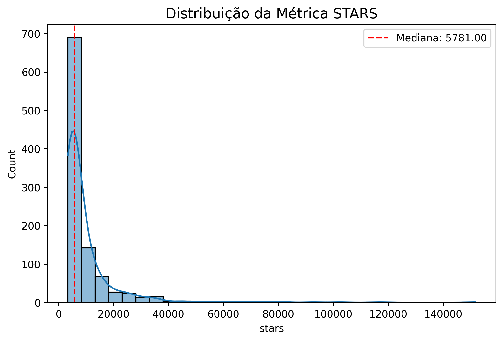
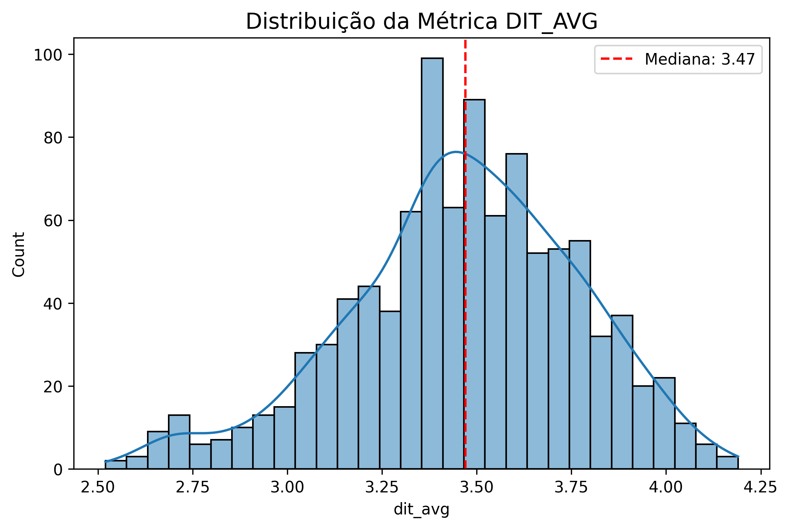

### 4.2. RQ1: Popularidade vs. Qualidade de Código

Contrariando a **H1**, a análise revela que a popularidade não está associada a uma melhor qualidade de código. Pelo contrário.

O mapa de correlação de Spearman mostra uma correlação forte e positiva (0.72) entre `stars` e `lcom_avg`, indicando que **projetos mais populares tendem a ser menos coesos**.

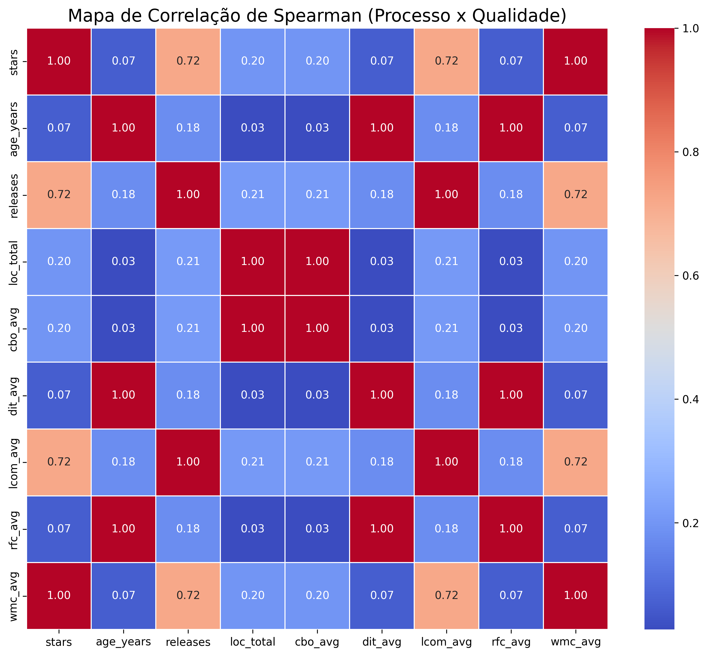

Os gráficos de violino demonstram que essa degradação da qualidade está concentrada no quartil superior de popularidade ("Muito Alta"). Para métricas como `LCOM`, `CBO` e `WMC`, os três primeiros quartis são homogêneos e saudáveis, enquanto o quartil superior exibe uma variabilidade muito maior e a presença de outliers com qualidade de código extremamente baixa.

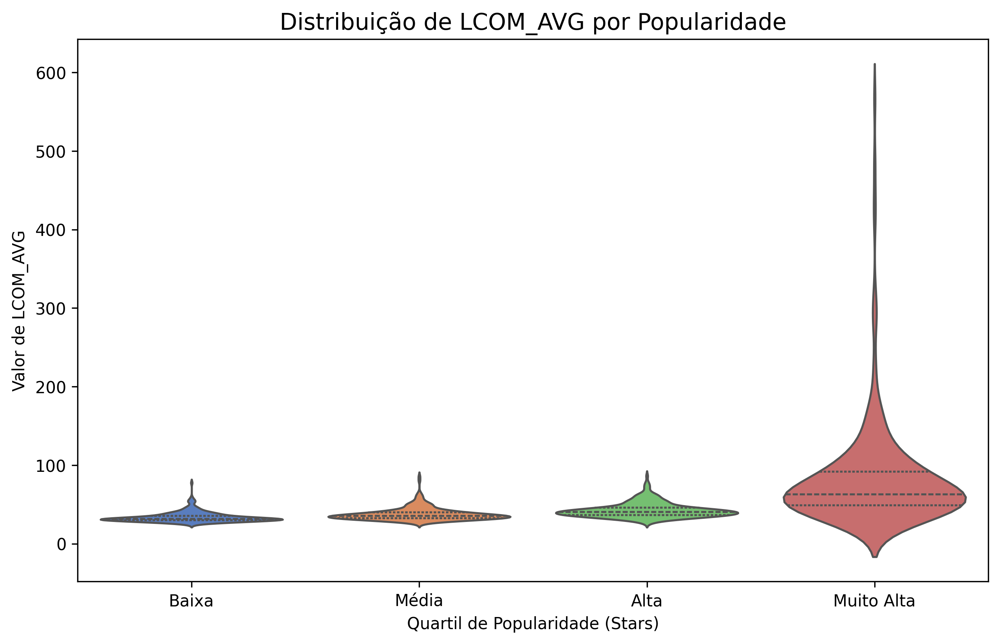

O gráfico sobreposto de densidade de complexidade (`WMC`) ilustra essa diferença de forma contundente. Projetos de baixa popularidade (vermelho) são homogeneamente simples. Projetos de altíssima popularidade (azul) são heterogêneos, contendo um subgrupo significativo de projetos muito mais complexos.

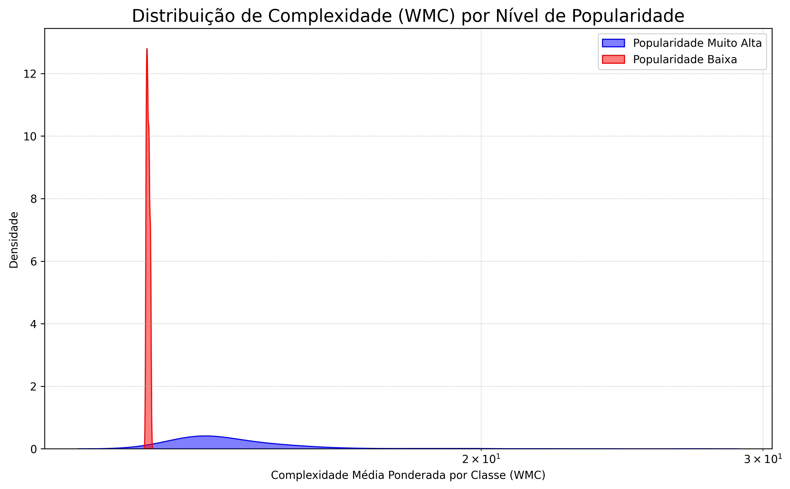

**Veredito H1: Rejeitada.** A popularidade extrema está associada a uma maior probabilidade de problemas de qualidade de código.

### 4.3. RQ2: Tamanho/Maturidade vs. Qualidade de Código

A **H2** é parcialmente suportada. O tamanho (`loc_total`) está fortemente correlacionado com o acoplamento (`cbo_avg`), como visto no gráfico de dispersão abaixo. À medida que os projetos crescem, eles se tornam inerentemente mais acoplados.

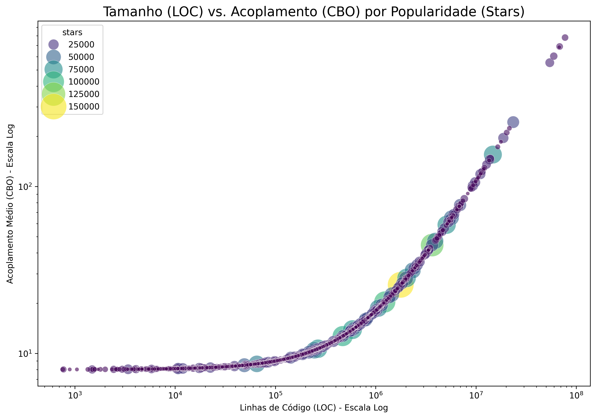

A **H3** não é suportada. A maturidade (`age_years`) apresentou correlações muito fracas com todas as métricas de qualidade no mapa de calor, indicando que a idade, por si só, não é um bom preditor de melhor ou pior qualidade de código.

**Veredito H2: Parcialmente Suportada.** O tamanho impacta negativamente o acoplamento.
**Veredito H3: Rejeitada.**

### 4.4. RQ3: Evolução da Qualidade de Código ao Longo do Tempo

A **H4** é fortemente suportada. A análise temporal revela uma melhoria sistemática na qualidade de código dos projetos Java ao longo dos últimos 15 anos.

As métricas `DIT` (Profundidade de Herança) e `RFC` (Response for a Class) mostram uma queda linear e consistente, indicando uma clara preferência por designs mais simples e com menor dependência de herança.

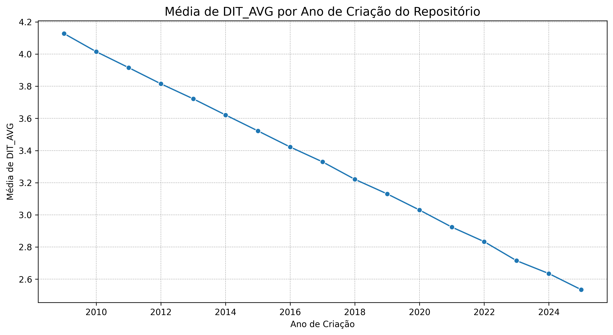
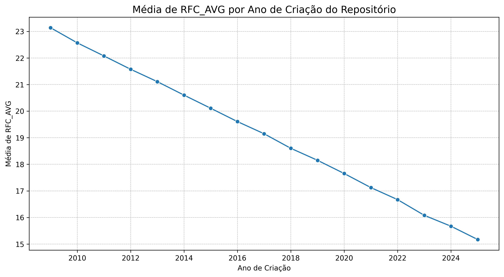

As métricas `CBO` (Acoplamento) e `LCOM` (Coesão) também mostram uma tendência geral de melhoria, apesar de mais voláteis.

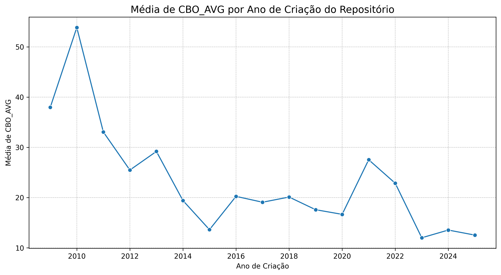
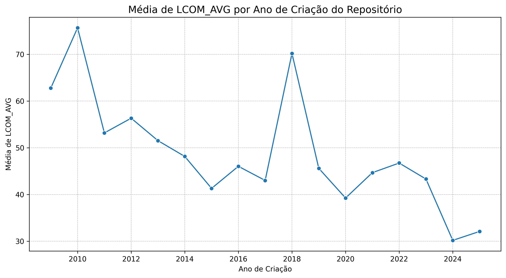

**Veredito H4: Suportada.** As práticas de design na comunidade Java evoluíram positivamente, resultando em software estruturalmente melhor.

### 4.5. RQ4: Interação entre Tamanho, Complexidade e Popularidade

Esta questão investiga se a popularidade muda a relação entre tamanho e complexidade, e a resposta é um claro **sim**.

O gráfico facetado abaixo mostra que para projetos com popularidade **Baixa, Média e Alta**, não há correlação entre tamanho (`loc_total`) e complexidade (`wmc_avg`). A complexidade se mantém baixa e constante, independentemente do tamanho.

No entanto, para o grupo de popularidade **Muito Alta**, a relação emerge: à medida que o tamanho aumenta, a complexidade também tende a crescer.

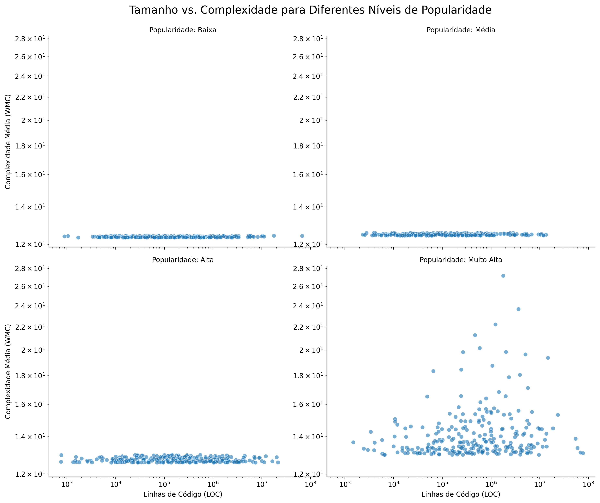

**Conclusão RQ4:** A popularidade atua como um fator moderador crítico. O desafio de gerenciar a complexidade conforme o projeto cresce é um problema que afeta desproporcionalmente os projetos mais populares do ecossistema.

---

## 5. Discussão

### 5.1. O Imposto da Popularidade

Os resultados sugerem a existência de um "imposto de popularidade" (popularity tax). Projetos que atingem um nível massivo de adoção e contribuição parecem sofrer com a degradação de sua arquitetura interna. O rápido ritmo de adição de features, a diversidade de estilos de codificação dos contribuidores e a dificuldade de realizar grandes refatorações podem contribuir para o aumento do acoplamento, da complexidade e da falta de coesão. O sucesso, neste caso, pode ser impulsionado por fatores não-técnicos (comunidade, documentação, utilidade da ferramenta) que superam as deficiências da qualidade do código.

### 5.2. A Evolução da Comunidade Java

A melhoria contínua nas métricas de qualidade ao longo do tempo é um forte indicativo da maturação da comunidade de desenvolvimento. A crescente ênfase em princípios como SOLID, a preferência por "composição sobre herança" e a influência de práticas de "código limpo" parecem ter gerado um impacto mensurável e positivo na forma como o software Java é projetado e construído.

### 5.3. Limitações do Estudo
É importante notar que correlação não implica causalidade. Além disso, as métricas CK, embora úteis, não capturam a totalidade do que constitui "qualidade de software", que também inclui aspectos como performance, segurança, usabilidade e qualidade da documentação.

---

## 6. Conclusão

Este estudo chegou às seguintes conclusões principais em resposta às questões de pesquisa:

- **RQ1:** A popularidade extrema não está associada a uma melhor, mas sim a uma maior heterogeneidade na qualidade do código, com uma presença significativa de projetos com métricas estruturais deficientes.
- **RQ2:** O tamanho de um projeto é um forte preditor de maior acoplamento, enquanto a maturidade não se mostrou um fator relevante para a qualidade do código.
- **RQ3:** As práticas de design na comunidade Java melhoraram de forma mensurável e consistente ao longo dos últimos 15 anos.
- **RQ4:** A relação entre o tamanho e a complexidade de um projeto é moderada pela sua popularidade; a complexidade só tende a crescer com o tamanho nos projetos mais populares.

**Recomendações Finais:**

- **Para Mantenedores de Projetos:** Ao gerenciar um projeto de rápido crescimento, priorize a **governança arquitetônica**. Implemente revisões de código rigorosas, automação de análise de qualidade e refatorações contínuas para combater o "imposto da popularidade".
- **Para Desenvolvedores Java:** As tendências do mercado são claras. Invista em aprender e aplicar princípios de design que favoreçam **baixo acoplamento, alta coesão e composição sobre herança**. A comunidade está se movendo nessa direção.
- **Para Pesquisadores:** Investigue os **fatores não-técnicos** que impulsionam o sucesso dos projetos "populares, mas de baixa qualidade" para entender melhor os drivers de adoção de software.